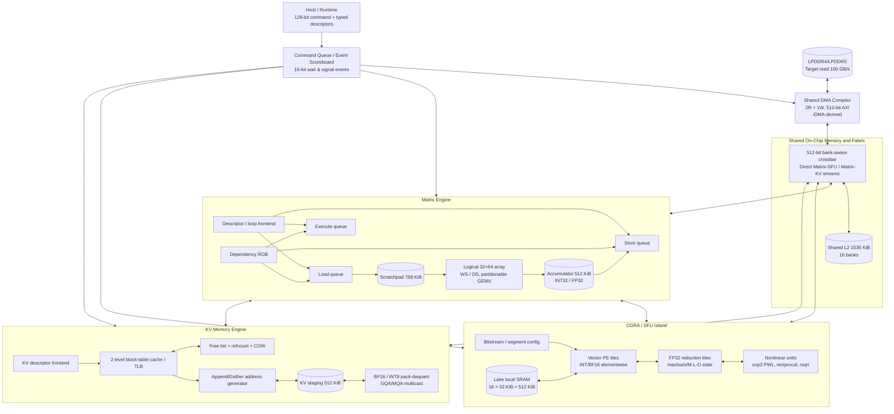
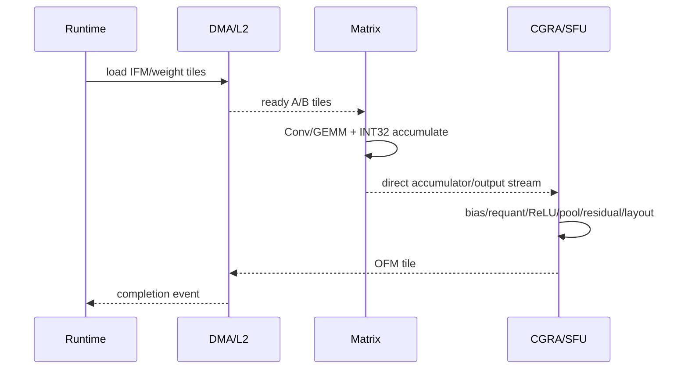

# Matrix Engine + CGRA/SFU + KV Memory Engine
## CNN/LLM 异构加速器架构与“复现—复用—改造—新写”执行规划

版本：2026-08-24 v0.1

## 1. 决策摘要

本工程不把 Stanford AHA/Onyx 直接扩成一颗“全 CGRA LLM 加速器”，也不从零重写完整 NPU。采用三引擎异构结构：

- **Matrix Engine**：以 Gemmini 为不可变基线，复用 systolic array、scratchpad、accumulator、load/execute/store decoupling、ROB 及 matmul/conv loop unroller；再逐步改成独立的 CNN/LLM 矩阵宏。
- **CGRA/SFU Engine**：以 Stanford AHA 的 Garnet + PEak + Lake + Canal 为不可变基线，先完成原版生成、映射、PnR 和 Gaussian 测试；随后把它收敛成处理 Norm、RoPE、Softmax、Activation、Pooling、Reduction、量化与布局变换的可编程 sidecar。
- **KV Memory Engine**：没有发现可直接复用的完整开源硬件实现。仅复用 PULP iDMA/PULP AXI/common_cells 的传输与互连部件，并参考 PagedAttention/vLLM 的分页语义；页表、分配、refcount、COW、append/gather、GQA/MQA multicast 和 KV INT8 数据通路采用新写 RTL。

IMAX3-LLM 用于审计 `llama.cpp` offload 边界、Qwen kernel 调用和量化数据布局，不作为 RTL 来源。所有第三方仓库都必须先在未修改状态下通过原生测试，之后才能创建 adapter；只有 adapter 无法满足目标时才允许维护最小 upstream patch。

## 2. 复用边界

| 领域 | 第一选择 | 原样复现内容 | 首轮只加 wrapper | 后续允许修改 | 必须新写 |
|---|---|---|---|---|---|
| Matrix | Gemmini/Chipyard | 官方软件、Spike、Verilator、mvin/mvout、matmul、conv/ResNet、生成 RTL | 128-bit command adapter、AXI/shared-L2 adapter、event adapter | 阵列规模、BF16 pipeline、GEMV partition、W4 load/unpack、direct streams | native W4 dual-dot、跨子阵列 reduction（若 Gemmini结构不适合） |
| CGRA/SFU | Stanford AHA | 4×16 Garnet、Gaussian map/PnR/test、Lake/Canal/PEak 原生测试 | tensor-stream/bitstream/event wrapper | PEak op、Lake memory controller、reduction/SFU tile、真实 boundary backpressure | 无法由 AHA 映射的宽向量/FPU macro |
| DMA/AXI | PULP iDMA/axi/common_cells | dependency/source/lint；有 Questa 时跑 upstream job | 512-bit AXI backend、shared-L2 ports | QoS、outstanding、gather midend | KV 地址生成和页级 coalescer |
| LLM mapping | IMAX3-LLM + llama.cpp | host build/source audit、kernel inventory | operator trace adapter | kernel descriptor lowering | 本项目 runtime/descriptor compiler |
| KV semantics | PagedAttention/vLLM | software reference tests | software-to-hardware trace | 无 | 页表、allocator、refcount、COW、append/gather、format conversion |

第三方代码不复制进本交付包。所有 adapter、clean-room RTL、测试和 patch 都保存在本工程，第三方 source 在本地 `work/upstream/` 单独克隆并保留原许可证。

## 3. 顶层硬件架构



### 3.1 固定接口

- Command：128 bit，字段为 opcode、engine、flags、wait event、signal event、src0/src1/dst descriptor index。
- Descriptor：128 bit 或多记录 typed descriptor；shape、stride、layout、dtype、scale、page table、sequence metadata 不塞进指令。
- Tensor stream：512-bit data + 64-bit byte enable + 16-bit tag + 12-bit tensor ID + format + last；全部使用真实 ready/valid。
- Completion：16-bit event ID + status + engine ID + counter。
- 引擎内部可以静态排程；引擎边界、外存、KV gather 和动态 request 路径必须支持 backpressure。

### 3.2 SRAM 预算

| Owner | KiB | 主要用途 |
|---|---:|---|
| Shared L2 | 1536 | 跨算子驻留、CNN tiles、LLM activation/weight tile、descriptor |
| Matrix scratchpad | 768 | A/B operands、double buffering、layout staging |
| Matrix accumulator | 512 | INT32/FP32 partial sums、bias、requant input |
| CGRA local | 512 | 16 tile × 32 KiB，Norm/Softmax/RoPE/pool window |
| KV staging | 512 | page gather coalescing、K/V tile、INT8 scale |
| Control/trace | 256 | command、events、page-table cache、performance trace |
| **Total** | **4096** | 与冻结配置一致 |

KV 数据本体不假设全部常驻 4 MiB SRAM。页表根、热点叶表和当前 K/V tile 在片上；完整 KV 以及模型权重位于 LPDDR。

## 4. Matrix Engine 演进策略

### 4.1 不直接把 Gemmini 改成 32×64

复现阶段使用官方 Gemmini 配置。第一轮架构放大优先选择：

1. 保持原生方阵和软件合同；
2. 验证 32×32 参数点，或组合多个 16×16/32×32 子阵列；
3. 对外呈现逻辑 32×64 Matrix Engine；
4. 只有当 loop unroller、scratchpad row width、transposer 和 software tiling 对矩形阵列全部验证后，才把底层物理阵列改成单体 32×64。

这样可以避免为了一个阵列尺寸同时破坏 Gemmini 的 `DIM` 假设、地址格式、loop FSM 和测试库。

### 4.2 数据类型分阶段

- **BF16 baseline**：BF16 operand、FP32 accumulate；PE latency 显式流水，不能假设一周期浮点 FMA。
- **W8A8**：INT8 dot、INT32 accumulation、per-tensor/per-channel requant。
- **W4 storage / W8 compute**：权重在 LPDDR/L2 以 INT4 保存，load path 按 G64/G128 解包和反量化到 INT8；此阶段只降低带宽，不声称 MAC 翻倍。
- **native W4A8 dual-dot**：一个 INT8 乘法位宽资源并行处理两个 signed INT4 weight；目标 4096 effective MAC/cycle。只有 RTL bit-exact、随机回归和 DC PPA 全部通过后才能替换 storage-only baseline。
- **KV INT8**：独立于 weight quant；per-token-head scale，SFU/attention input 处解量化。

### 4.3 CNN 模式

- 常规 Conv/GEMM/FC：Matrix Engine，优先复用 Gemmini loop-conv/matmul unroller。
- 1×1 Conv：直接 GEMM。
- Depthwise Conv：优先映射 CGRA/Lake line/tile buffer；若 utilization 仍低，再增加专用 depthwise vector mode。
- Pooling、ReLU/ReLU6、residual add、requant、layout transform：CGRA/SFU。
- Winograd 不进入 v0；先以 direct/im2col baseline 保证可验证性。

### 4.4 LLM 模式

- Q/K/V/O projection、MLP gate/up/down：Matrix Engine。
- QK 和 PV：Matrix Engine 的 attention modes；partial score/output 不落外存。
- Decode GEMV：阵列切成多个独立 column groups；在 request/batch、output channel 和 expert 维并行，避免 M=1 时整阵列空转。
- Matrix→SFU、Matrix→KV、KV→Matrix 建立 direct stream；shared L2 是回退路径而不是所有中间数据的必经点。

## 5. CGRA/SFU 演进策略

### 5.1 原样基线

先跑 AHA 官方 4×16 Garnet 生成与 Gaussian map/PnR/test，保留其 submodule commit lock。该阶段不改 PEak、Lake、Canal、Garnet 或 mapper。

### 5.2 Wrapper 阶段

- 将 AHA macro 当作独立可配置 accelerator。
- bitstream 在 segment 开始前装载。
- IO tile 外增加 512-bit tensor stream gearbox、tag/last、真实 ready/valid 和 completion event。
- 静态 dataflow 可以保留；边界不能把 ready/valid 绑常量。

### 5.3 最小 upstream 扩展

按以下顺序增加能力，每个扩展都必须先有 PEak functional semantics、mapper rule、RTL 和独立测试：

1. reduce_sum / reduce_max + FP32 accumulation；
2. BF16 add/mul/compare/select；
3. RoPE pair rotate；
4. exp2 PWL、reciprocal、rsqrt + Newton；
5. online-softmax M/L/O update；
6. RMSNorm/LayerNorm reduction schedule；
7. SiLU/GELU；
8. INT8/BF16 quant/dequant 和 layout transform。

如果某操作需要宽 SIMD 或多周期 FP pipeline，优先作为异构 tile 加入 Garnet，而不是把每个普通 PE 都膨胀成大 SFU。

## 6. KV Memory Engine

### 6.1 子模块

```text
KV Command Frontend
  ├─ Sequence/Layer Metadata SRAM
  ├─ Root Table SRAM
  ├─ Leaf Table Cache/TLB
  ├─ Free-list Allocator
  ├─ Reference Counter
  ├─ Copy-on-Write Controller
  ├─ Append Address Generator
  ├─ Gather/Coalescing Address Generator
  ├─ Sliding-window Filter
  ├─ BF16 / INT8 Packer-Dequantizer
  ├─ GQA/MQA Multicast
  └─ iDMA AXI Backend
```

### 6.2 页语义

逻辑地址：

```text
{sequence_id, layer_id, kv_head_id, logical_token, element_offset}
```

映射：

```text
logical_page = logical_token / page_tokens
page_offset  = logical_token % page_tokens
physical_page = block_table[sequence, layer][logical_page]
```

v0 页大小固定为 16 token。页表采用两级结构，避免为最大 sequence×layer×context 在片上铺平。Prefix sharing 对完整页增加 refcount；对非整页前缀复制有效 token。写共享页前执行 COW。Gather 必须按物理页合并 burst，并输出按逻辑 token 顺序排列的 K/V stream。

### 6.3 实现顺序

1. append/read/free，BF16，单 sequence；
2. 多 sequence/layer、两级页表和 translation pipeline；
3. paged gather + burst coalescing；
4. GQA/MQA multicast；
5. INT8 per-token-head scale；
6. prefix share/refcount/COW；
7. sliding window、eviction、generation ID；
8. continuous batching 和多请求公平仲裁。

## 7. CNN 执行流



CNN segment 尽量将 `Conv → bias/requant → activation → pool/residual` 保持为一个 segment。Depthwise/pointwise block 允许 Matrix 和 CGRA 并行：CGRA 处理 depthwise tile 时 Matrix 预取下一层 pointwise weights。

## 8. LLM Prefill 执行流

```text
Input token tile
  → SFU RMSNorm
  → Matrix fused Q/K/V projections
      Q → SFU RoPE ───────────────┐
      K → SFU RoPE → KV append    │
      V ─────────────→ KV append  │
                                  ↓
      KV gather tile → Matrix QK → SFU scale/mask/online softmax M,L
                     → Matrix PV → SFU online O rescale/merge
  → Matrix O projection
  → residual
  → SFU RMSNorm
  → Matrix gate/up projection
  → SFU SiLU × up
  → Matrix down projection
  → residual / next block
```

禁止生成完整 `sequence × sequence` score tensor 写回 LPDDR。QK、online softmax 和 PV 以 context block 流水，M/L/O 保持 FP32。Q 不落地；K/V 在 RoPE 后直接 append；OProj/MLP weight prefetch 与 attention 尾部重叠。

## 9. LLM Decode 执行流

```text
Token
  → RMSNorm
  → partitioned GEMV Q/K/V
  → RoPE + KV append
  → paged KV gather (context shards)
  → parallel QK dot
  → online-softmax shard merge
  → PV reduction
  → OProj GEMV
  → RMSNorm
  → gate/up GEMV + SiLU
  → down GEMV
```

Decode 的主要约束是权重和 KV 带宽，不是峰值矩阵 TOPS。调度器应：

- 跨 request/batch 拼接 GEMV；
- 将逻辑 32×64 阵列切成多个独立 subarray；
- 在 context 维拆 attention，再以 M/L/O associative merge 合并；
- weight DMA、KV gather、Matrix、SFU 四路重叠；
- 为 KV 与 weight 设置独立 outstanding/QoS，防止长 context gather 饿死权重流。

## 10. 128-bit ISA 与 descriptor 原则

固定指令只负责选择 engine、operation、事件依赖和 descriptor 索引。Descriptor 保存：

- tensor base、shape、strides、layout、dtype；
- matrix M/N/K、dataflow、subarray mask、accumulate mode；
- quant group、scale/zero point 地址；
- SFU program/bitstream、vector length、reduction axis；
- KV sequence/layer/head/token/page table、format；
- DMA burst、2D/3D stride、QoS。

这样新增 Qwen/Llama/DeepSeek variant 时不修改顶层 RTL，只扩 descriptor legality、microcode/bitstream 和 compiler lowering。

## 11. 分阶段执行计划

| Stage | 原则 | 主要输出 | 进入下一阶段的硬门禁 |
|---|---|---|---|
| L0 | 冻结合同 | YAML、ISA、Python模型、clean-room RTL | 本包全部 sandbox test PASS |
| L1 | 原样复现 | Commit lock、Gemmini/AHA/iDMA/IMAX logs | upstream clean tree；官方 baseline 全 PASS |
| L2 | Wrapper only | Matrix/AHA command、stream、event adapter | 原版与包 adapter 后数值等价；无 upstream patch |
| L3 | 共享 Fabric | 512-bit L2 crossbar、DMA、event scoreboard | 随机 backpressure；无丢包/重复/死锁 |
| L4 | CNN baseline | Conv/GEMM/depthwise/pool/requant flows | operator bit-exact；ResNet50/MobileNet subset 与 golden 一致 |
| L5 | BF16 LLM | 单 block prefill/decode、paged KV basic | Q/K/V/O、Norm、Attention、MLP 分节点误差门禁 |
| L6 | W8/W4 | W8A8、W4-storage、group scales | 与离线 quant golden 一致；W4 不误称双吞吐 |
| L7 | KV advanced | gather、GQA/MQA、INT8、prefix/COW | 随机 allocator/refcount/page trace 通过 |
| L8 | Native W4 | dual-dot PE 与 unpack pipeline | exhaustive nibble test + random GEMM + DC PPA |
| L9 | End-to-end | Qwen 0.6B/1.5B layer/model trace | prefill/decode numerical + completion + memory trace |
| L10 | 22nm DC | mapped netlist、STA、area/power | 1.0 ns setup WNS≥0；0 unmapped；SRAM macro linked |
| L11 | Architecture sweep | 16×16 clusters / 32×32 / logical 32×64 | Pareto report；目标点有真实 RTL PPA/cycle证据 |

## 12. 验证金字塔

1. NumPy operator golden；
2. Python heterogeneous functional model；
3. 独立 C++ reference；
4. 原创 small RTL contract test；
5. upstream original tests；
6. adapter unit test；
7. macro Verilator co-simulation；
8. integrated RTL tests with randomized ready/valid and page traces；
9. model-layer trace against PyTorch/llama.cpp；
10. DC netlist simulation and STA。

每一级输出统一 trace：command、descriptor hash、tensor ID、event、cycle、bytes、MAC、page translation、numerical checksum。任何失败必须能定位到 lowering、scheduler、adapter、macro、fabric、KV 或 numerical contract，而不是只报告最终 tensor mismatch。

## 13. 性能目标解释

冻结的逻辑 32×64 INT8 阵列在 1 GHz 下是 2048 MAC/cycle，即 2.048 TMAC/s。对假设 1.5B 个主要线性权重、500 token/s 的 prefill，仅线性层约需 0.75 TMAC/s，即约 36.6% INT8 峰值；Attention、Norm、layout 和 stall 会提高所需利用率。

在 100 GB/s 外存读带宽下，单请求 decode 的理想 weight-only 上限约为：

- W8：1.5 GB/token，对应约 66.7 token/s；
- W4：0.75 GB/token，对应约 133.3 token/s。

这些不是预测性能，只是上界。真实值还要扣除 KV、scale、burst 效率、bank conflict、调度和多层同步。10 token/s 目标对应约 15 GB/s W8 或 7.5 GB/s W4 weight traffic，因此带宽预算本身可行；关键门禁是 GEMV 利用率和 KV/weight overlap。

## 14. 当前沙箱实际完成

已实际执行：

- 27 项 Python test：PASS；
- CNN 两层 toy graph：INT8 direct reference 与 Matrix+SFU 路径逐元素一致；
- BF16 toy Transformer block：连续 KV 与 paged KV 路径 max error = 0；
- INT8 KV toy block：误差在报告阈值内；
- 独立 C++17 INT8 GEMM + paged KV smoke：PASS；
- 6 个 clean-room SystemVerilog module：结构检查 PASS；
- 128-bit command pack/unpack、W4 pack/group quant、online softmax、RoPE、prefix sharing/COW model、cycle scheduler 均有单元测试；
- 4 MiB SRAM partition 求和一致；
- 分析型 CNN/LLM task/cycle report 已生成。

未完成且未声称完成：

- 当前完整 Chipyard recursive clone 尚未完成，`UPSTREAM_LOCK.json` 尚未生成；但 targeted GemminiRocketConfig 已按锁定 commit 补齐依赖，官方 Gemmini RTL/Verilator、mvin/mvout、FAST matmul 和 OS matmul baseline 已有证据；N=2 WS/扩展组合仍受 10M-cycle timeout，AHA 原版 baseline 尚未关闭；
- 当前主机已安装/可复用 Verilator 5.050、sbt 1.12.6、OpenJDK 17 和 Yosys 0.9；Docker、Spike、RISC-V cross compiler、Slang/Surelog 仍缺失；
- clean-room RTL 已完成 Icarus/Verilator 编译，L5/L6 contract integration 已通过，shared-L2 已完成 10,000 transaction smoke；
- L7-L10 已完成 model-level regression（含 100,000 KV commands），L11 已完成 clean-room integrated Matrix/SFU/KV numerical RTL/model regression（q128/q384/decode4096/continuous model cases，20-cycle concurrent RTL kernel trace）；官方 GemminiRocketConfig 已完成第一版宏级 RTL 生成并通过 targeted mvin/FAST matmul，完整 hetero top/官方宏数值 co-sim 仍未完成；
- TSMC CLN22UL SVT `.db` 已用于五个 contract top（含 integrated numerical shell）的 DC smoke；集成 shell 0 unmapped、1 GHz WNS 为 `9.75132e-05 ns`，但生产 SRAM wrapper/link、官方 macro equivalence 和完整 numerical RTL co-simulation 仍未完成。

对应执行命令、产物路径和验收标准位于 `local_agent/AGENT_EXECUTION_GUIDE.md` 与 `local_agent/stages.yaml`。
